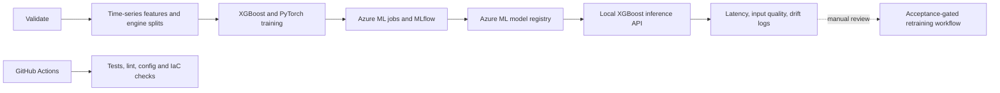

# 🛠️ EPM Platform

An Azure Machine Learning project for **predictive maintenance and remaining useful life (RUL) estimation** using industrial time-series data.

> **Current model:** XGBoost trained on industrial equipment sensor turbofan data. It is not validated for real aircraft, wind turbines, or other equipment.

## 👀 About The Project

EPM Platform demonstrates an end-to-end ML lifecycle: data validation, time-series feature engineering, XGBoost and PyTorch training, MLflow tracking, Azure ML model registration, local inference, monitoring, and acceptance-gated retraining.

## 🧠 What It Does

- 🔹 Builds causal sensor features and engine-disjoint evaluation splits.
- 🔹 Trains and evaluates XGBoost and PyTorch RUL models.
- 🔹 Tracks Azure ML/MLflow runs and registers the selected XGBoost model.
- 🔹 Serves local `/health` and `/score` endpoints with input validation.
- 🔹 Logs inference latency, prediction summaries, and basic data-drift indicators.
- 🔹 Validates retraining and promotion logic without automatic retraining.

## ⚙️ Architecture



| Component | Responsibility |
|---|---|
| **Data and features** | industrial equipment sensor validation, causal feature engineering, reproducible engine splits. |
| **Models** | XGBoost baseline and CPU PyTorch time-series model. |
| **Azure ML + MLflow** | Remote training history, metrics, artifacts, and versioned model asset. |
| **Local serving** | Loopback-only inference API using the registered XGBoost model artifact. |
| **Monitoring and retraining** | Structured local health/drift signals and a manual, acceptance-gated workflow. |
| **GitHub Actions** | Automated code, test, configuration, and infrastructure validation. |

## 🛠️ Tech Stack

<p align="left">
  
</p>
<p align="left">
  
  
  
  
</p>


## 🚀 Run Locally

From the VS Code PowerShell terminal at `C:\EPM Platform`, with the project `.venv` active:

```powershell
python -m epm_platform.serving.local_api `
  --model-dir .\artifacts\baseline\epm-baseline-de82ea3141be `
  --host 127.0.0.1 --port 8000
```

Leave that terminal running. Open a second terminal and test 100 sample engines:

```powershell
python .\scripts\build_endpoint_smoke_request.py `
  --output .\.azure\endpoint-smoke-request.json --sample-size 100

Invoke-RestMethod http://127.0.0.1:8000/health

$result = Invoke-RestMethod -Uri http://127.0.0.1:8000/score `
  -Method Post -ContentType application/json `
  -InFile .\.azure\endpoint-smoke-request.json

$result.predictions.Count
$result.predictions | Select-Object -First 5
```

The sample request is built from industrial equipment sensor training observations. To score custom data, use the exact request schema and sensor units documented in [deployment and monitoring](docs/deployment-monitoring.md). The API accepts structured JSON, not a text prompt.

## 📚 Documentation

- [Architecture and project summary](docs/architecture.md)
- [Setup and operations](docs/setup.md)
- [Data preparation and quality](docs/data-setup.md) · [quality report](docs/data-quality-report.md)
- [Baseline results](docs/baseline-results.md) · [PyTorch results](docs/pytorch-results.md)
- [Model selection and registry](docs/model-registry.md)
- [Deployment and monitoring](docs/deployment-monitoring.md)
- [Retraining and CI/CD](docs/retraining-cicd.md)

## 📁 Project Structure

```text
src/epm_platform/   Data, features, training, serving and retraining modules
config/             Dataset and environment configuration
infra/              Azure foundation and data-access Bicep
scripts/            Setup, validation, training and local inference commands
tests/              Unit and integration tests
docs/               Architecture, results, operations and validation evidence
.github/workflows/  GitHub Actions CI
```
