# EPM Platform — final architecture and project summary

## Project summary

EPM Platform is a phase-complete development MLOps reference for NASA C-MAPSS
remaining-useful-life (RUL) regression. It preserves and validates the original data,
builds causal engine-bounded features, trains and compares CPU XGBoost and PyTorch
models, tracks Azure ML/MLflow lineage, registers the selected XGBoost model, and
provides local scoring, aggregate drift signals, acceptance-gated retraining, and
GitHub-hosted CI. One validation-only Azure retraining job was completed and rejected
by the promotion gate; it used a synthetic trigger, not production drift evidence.

The final project intentionally has **no retained managed online endpoint**, scheduled
Azure retraining, production telemetry pipeline, GitHub Azure credentials, GPU, or
automated model deployment. The actual Azure endpoint attempt failed during endpoint
provisioning; the endpoint was deleted. Its Activity Log error did not identify the
provider name, so no speculative provider registration or retry was made. Local
loopback inference is the verified serving path, not a production public API.

## Final architecture

```mermaid
flowchart LR
    subgraph Dev["Developer / GitHub (no Azure CI credentials)"]
        Raw["NASA C-MAPSS source<br/>immutable raw archive"]
        Data["Validate and curate<br/>versioned Parquet + quality evidence"]
        Features["Causal feature pipeline<br/>engine-disjoint splits"]
        XGB["CPU XGBoost baseline"]
        Torch["CPU PyTorch MLP"]
        Tests["Local tests, lint,<br/>Bicep contracts, CI"]
        API["Loopback inference API<br/>strict schema + XGBoost"]
        Drift["Aggregate latency, quality<br/>and range-drift summaries"]
        Retrain["Manual retraining planner<br/>trigger + promotion gates"]
    end

    subgraph Azure["Azure (existing development workspace)"]
        Workspace["Azure ML workspace<br/>Entra ID + managed identities"]
        Storage["Workspace storage<br/>versioned data and job artifacts"]
        CPU["cpu-dev AmlCompute<br/>Standard_D2s_v3, min 0 / max 1"]
        MLflow["Azure ML / MLflow<br/>training runs and artifacts"]
        Registry["Azure ML model asset<br/>epm-cmapss-rul-xgboost:1"]
        Telemetry["Workspace dependencies<br/>Application Insights + Log Analytics"]
    end

    Raw --> Data --> Features
    Features --> XGB
    Features --> Torch
    Features --> Storage
    Workspace --> CPU
    CPU --> XGB
    CPU --> Torch
    XGB --> MLflow
    Torch --> MLflow
    MLflow --> Storage
    XGB --> Registry
    Registry --> API
    API --> Drift
    Drift --> Retrain
    Retrain -. explicit operator approval .-> CPU
    Retrain -. accepted candidate only .-> Registry
    Tests -. no Azure job/deployment .-> Dev
    Workspace -. workspace dependency only .-> Telemetry
```

The diagram distinguishes implemented control/data flows from gated or local-only
flows: the dashed retraining edges describe the approved, explicitly operator-triggered
code path. One validation-only job has exercised that path, but there is no active
schedule or production drift/performance input. Workspace Application Insights and
Log Analytics are dependencies; local request monitoring is not currently exported
to those services.

## Lifecycle and evidence

| Capability | Final implementation / evidence |
|---|---|
| Data | Original NASA archive retained unchanged; schema/data-quality validation; curated, versioned Azure ML asset. See [data setup](data-setup.md), [quality report](data-quality-report.md), and [Phase 2 evidence](phase-2-validation.md). |
| Features and splits | 35 causal features; history bounded by engine; deterministic engine-disjoint train/validation/test. See [feature contract](features.md). |
| Baseline and deep learning | Reproducible XGBoost and CPU PyTorch training in Azure ML v2 command jobs, with common evaluation. XGBoost selected on test RMSE and asymmetric NASA score. See [baseline results](baseline-results.md) and [PyTorch comparison](pytorch-results.md). |
| Tracking and registry | MLflow run evidence; registered Azure ML custom model `epm-cmapss-rul-xgboost:1`, with source job lineage. See [registry record](model-registry.md). |
| Inference and monitoring | Strict native-model-verified XGBoost scoring, loopback HTTP API and payload-free aggregate monitoring. Azure endpoint was not retained; cloud endpoint metrics are not live. See [deployment and monitoring](deployment-monitoring.md). |
| Retraining and promotion | One Azure ML command job validated the training/artifact/acceptance path with a marked synthetic trigger; identical incumbent metrics were rejected, with no new model version. No real field signal or schedule. See [retraining policy](retraining-cicd.md). |
| CI/CD | Public GitHub repository `Tanveer-F/EPM-Platform`; hosted Windows CI passed on the complete source tree, including data tests, PyTorch/MLflow, lint and Bicep contracts. CI uses no Azure credentials or billable Azure jobs. See [workflow](../.github/workflows/ci.yml) and [successful run](https://github.com/Tanveer-F/EPM-Platform/actions/runs/36300859381). |

## Security and operational boundaries

- Local authentication uses an explicitly selected Entra credential; workload identities
  are managed identities. No service principal secret or storage key is embedded.
- Storage shared-key and anonymous blob access are disabled. Azure foundation service
  endpoints are public but authenticated; this development topology is not a private
  production network.
- The local API binds only to loopback and omits request payloads/engine IDs from its
  aggregate inference logs. It is a developer test surface, not a hardened production
  web server.
- CI uses read-only repository permissions, contains no Azure secrets, and does not
  contact Azure control/data planes for training, promotion or deployment.
- Retraining defaults to local planning. Remote submission requires the explicit
  `--approve-costs` flag, reuses the existing one-node CPU cluster/job limit and never
  automatically deploys a registered candidate.
- The current acceptance benchmark reuses the pinned public 707-engine C-MAPSS test
  set for comparability. Repeated use can overfit model selection; establish a
  reviewed rolling field-data evaluation before operational promotion.
- Azure ML CPU scales to zero when idle, but storage, retained artifacts, telemetry
  dependencies and service-managed networking can still incur charges. No exact
  historical invoice is asserted.

## Local verification

Follow [setup and operations](setup.md) to create clean Python 3.12 environments and
run unit/integration tests, the isolated PyTorch/MLflow suite, Ruff and Bicep checks.
After downloading the verified model asset and preparing local source data, use the
loopback commands in [deployment and monitoring](deployment-monitoring.md). No
training, endpoint, or Azure resource is needed for the normal test suite.

### Final validation evidence

| Check | Result |
|---|---|
| Main project suite | **691 passed, 3 skipped**; skips are the isolated optional PyTorch/MLflow runtime and Windows symlink privilege case. |
| Isolated PyTorch/MLflow suite | **94 passed**. |
| Project Ruff and dependency consistency | Passed (`ruff check src tests scripts`; `pip check`). |
| Infrastructure contracts | Bicep compiled; **49 checks passed**. Checkov reported 9 passed, 0 failed, and 6 documented exceptions. |
| Data/model integrity | Raw archive, curated bundle, ML-ready manifest, baseline outputs and registered-model artifact hashes verified. |
| Local inference | Real-model API smoke test passed for 20 representative engine histories; PyTorch checkpoint reload produced a finite nonnegative prediction. |
| Current Azure state | Read-only inventory: `cpu-dev` provisioning succeeded, min=0/max=1 and **0 nodes**; **0 active jobs** and **0 online endpoints**. |
| GitHub-hosted CI | **Passed** on `main` at commit `accc4b5c642b5b5d7f0b3e247a69d7e430720eef`; all nine workflow steps succeeded. An earlier run exposed an overbroad `/data` ignore rule; it was narrowed to root `/data/` so application sources and tests are included while raw data remains ignored. |
| Secret review | 127 tracked files scanned. High-entropy findings were project SHA-256 fingerprints and test-only placeholder strings; no real credential or token was found. `.azure`, environments, raw data and generated model artifacts remain excluded. |
| Azure retraining | Job `epm-baseline-afb4088b7b41` completed on the existing CPU cluster. The validation-only trigger was synthetic; the candidate exactly matched the incumbent and was rejected, so registry version 1 remains the only model version. |
